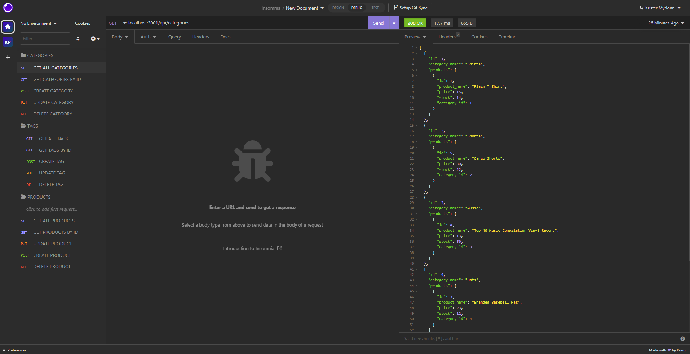

# Kristers E-Commerce Back End 
      

  
  ## Description
E-Commerce Back End application shows some of my newly learned skills working with node.js, MySQL2 and sequilize. I have learned an introduction in how you can build database properties with using the input of the user to create, update,view and delete the database information in a more functional and easier way using sequilize.  
  
  ## Table of Contents
  * [Installation](#installation)
  * [Usage](#usage)
  * [Credits](#credits)
  * [License](#license)
  * [Contributing](#contributing)
  * [Questions](#questions)

  ## Installation
  Download and install folder, install node and run npm i. run schema.sql, then npm run seed followed by npm start for it to listen on the port.
  Github Repository: https://github.com/kristermyr/E-commerce-Back-End

  ## Usage
  
  Walkthough: https://youtu.be/d12s5MnykjY

  ## Dependencies
  Inquirer, MySQL2, sequilize, dotenv
  ## Credits
 
   BCS Learning Assistants: 
  * Ben Christensen
  * Liz Edieterich

  ## Github
  * https://github.com/mjgiannelli/e-commerce-back-end

  ## Class activities
  * Activity 5
  * Activity 8
  * Activity 12

  ## Collaborators
  * Dylan Quaale - https://github.com/dylanquaale/e-store

  ## License
  MIT

  ## Contributing
  Create a new branch and submit a pull request

  ## Questions
  Github Username: kristermyr
  Please send me an E-mail if you have any questions [here](mailto:krister90@gmail.com) or visit https://github.com/kristermyr

